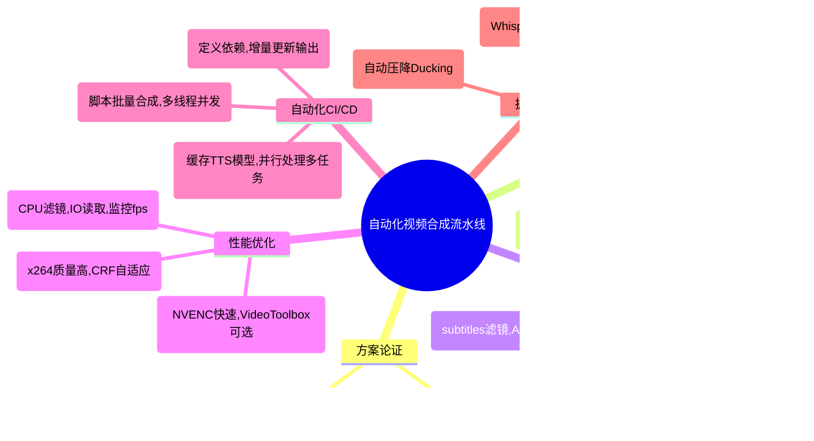

# 图片、TTS语音和字幕的全自动 MP4 视频合成流水线技术报告

## 1. 方案论证

**剪映工程 JSON 自动化方案：**早期可以通过直接修改剪映 (CapCut/剪映专业版) 的 `draft_content.json` 项目文件来自动化视频生成。然而在 6.x 版本后，剪映开始对项目文件进行**AES-CBC 加密**处理，试图防止工程文件被非法利用 ([capcut-export/README.md at master · emosheeep/capcut-export · GitHub](https://github.com/emosheeep/capcut-export/blob/master/README.md#:~:text=%3E%202024,end%20of%20life%20unfortunately))。这意味着简单地生成或修改 JSON 来构建剪映工程已不可行，因为解密和重新加密该文件需要深入逆向剪映应用，难度极高。此外，剪映并未提供官方的命令行接口来批量导出项目，必须借助非官方工具或破解，其**维护成本**和**法律风险**都很高。一位开源项目作者就指出，由于剪映项目文件加密，他的 CapCut 导出工具被迫停止更新 ([capcut-export/README.md at master · emosheeep/capcut-export · GitHub](https://github.com/emosheeep/capcut-export/blob/master/README.md#:~:text=%3E%202024,end%20of%20life%20unfortunately))。总之，**剪映 JSON 自动化方案的劣势**在于高度依赖剪映内核，面对加密和版本升级很脆弱，灵活性和可扩展性差。

**TTS + FFmpeg 合成方案：**使用**文本转语音 (TTS)** 和 **FFmpeg** 滤镜链来自行合成视频，则完全避开了剪映的软件限制。该方案具有多方面优势：

- **维护成本低**：FFmpeg 和开源 TTS 工具都是稳定的开源项目，接口成熟，不会因剪映升级而失效 ([capcut-export/README.md at master · emosheeep/capcut-export · GitHub](https://github.com/emosheeep/capcut-export/blob/master/README.md#:~:text=%3E%202024,end%20of%20life%20unfortunately))。
- **后期灵活性强**：可以自由编排图像特效（缩放平移、转场）、配音和字幕样式，突破剪映GUI功能限制。修改流程中的某个环节（换声音、换滤镜）也无需担心加密或兼容性问题。
- **性能可控**：利用 NVIDIA GPU 的硬件加速和多线程，可以显著提升渲染速度（详见第4节）。不受制于剪映可能存在的性能瓶颈，可充分利用服务器/工作站资源。
- **版权合规**：完全使用自主或开源组件，避免了直接调用剪映内部素材或算法而可能引发的版权问题。配乐、字体等素材也可自行选择授权范围，输出的视频更适合商业发布。

当然，替代方案的不足之处在于需要自行开发整套流水线，初始工作量较大。但鉴于剪映官方不支持项目自动化且文件已加密 ([capcut-export/README.md at master · emosheeep/capcut-export · GitHub](https://github.com/emosheeep/capcut-export/blob/master/README.md#:~:text=%3E%202024,end%20of%20life%20unfortunately))，采用**“TTS 合成 + FFmpeg 视频渲染”**的路线是目前可行且稳健的选择。

此外，需要注意剪映 `draft_content.json` 的**AES-CBC 加密逻辑**：其密钥保存在剪映应用内部，逆向解密需要对应用进行反编译或动态调试。这涉及违反应用的使用协议和潜在法律风险，并且加密密钥可能绑定用户账户或设备，使得普适的解密工具难以实现。因此，本报告聚焦开源方案，不再深入剪映加密逆向细节。

## 2. TTS 组件深度分析

本流程需要将文本内容转换为语音解说，可选用微软的 Edge TTS 服务或本地开源的 Coqui TTS 工具。下面分别对这两种 TTS 引擎进行分析。

**微软 Edge TTS：**Edge TTS 是利用微软 Azure 云端语音服务的非官方工具，它提供了简单的命令行接口 ([edge-tts · PyPI](https://pypi.org/project/edge-tts/#:~:text=Basic%20usage))。常用参数包括：

- `--text`：待合成的文本内容（字符串）。例如 `--text "你好，欢迎收看"` ([edge-tts · PyPI](https://pypi.org/project/edge-tts/#:~:text=Basic%20usage))。
- `--voice`：指定使用的语音名称。微软提供多种语言和音色的神经网络声音，可用 `--list-voices` 列出全部可用声音 ([edge-tts · PyPI](https://pypi.org/project/edge-tts/#:~:text=You%20can%20change%20the%20voice,to%20list%20all%20available%20voices))。中文常用声音如**“晓晓”**(zh-CN-XiaoxiaoNeural)为女性温暖风格，适合新闻和小说旁白 ([list of voices available in Edge TTS.txt · GitHub](https://gist.github.com/BettyJJ/17cbaa1de96235a7f5773b8690a20462#:~:text=Name%3A%20Microsoft%20Server%20Speech%20Text,Warm))；**“晓伊”**(zh-CN-XiaoyiNeural)为女性活泼风格，适合动画解说 ([list of voices available in Edge TTS.txt · GitHub](https://gist.github.com/BettyJJ/17cbaa1de96235a7f5773b8690a20462#:~:text=Name%3A%20Microsoft%20Server%20Speech%20Text,Lively))；**“云扬”**(zh-CN-YunyangNeural)为男性专业稳重音，适合新闻播报 ([list of voices available in Edge TTS.txt · GitHub](https://gist.github.com/BettyJJ/17cbaa1de96235a7f5773b8690a20462#:~:text=Name%3A%20Microsoft%20Server%20Speech%20Text,Professional%27%2C%20%27Reliable))；还有**“云希”**(zh-CN-YunxiNeural)等男性青年音，明亮阳光 ([list of voices available in Edge TTS.txt · GitHub](https://gist.github.com/BettyJJ/17cbaa1de96235a7f5773b8690a20462#:~:text=Name%3A%20Microsoft%20Server%20Speech%20Text,Lively%27%2C%20%27Sunshine))。可根据场景选择合适音色。
- `--write-media`：输出语音音频文件路径。支持格式包括 MP3/WAV 等 ([edge-tts · PyPI](https://pypi.org/project/edge-tts/#:~:text=Basic%20usage))。
- `--write-subtitles`：输出字幕文件路径（例如 `.srt` 或 `.vtt` 文件） ([edge-tts · PyPI](https://pypi.org/project/edge-tts/#:~:text=Basic%20usage))。Edge TTS 会自动对文本进行分句，并生成对应的时间戳字幕。

使用示例：  

```bash
edge-tts --voice zh-CN-XiaoxiaoNeural --text "欢迎来到本次教程" --write-media output.mp3 --write-subtitles output.srt
```  

上述命令将调用**晓晓**的中文女声合成语音，并保存为 `output.mp3`，同时生成与语音对齐的字幕文件 ([edge-tts · PyPI](https://pypi.org/project/edge-tts/#:~:text=Basic%20usage))。在实际应用中，可将每段解说文本分别合成音频和字幕，以便后续和对应图片同步。

Edge TTS 的优点是**音质自然**（依托微软AI模型）且支持多语种发音，无需本地计算资源。但它需要联网调用云服务，文本过长时可能触发API限制（需将长文本切片合成 ([Edge TTS Reader | Tech Shinobi](https://techshinobi.org/posts/edgetts/#:~:text=I%20tried%20to%20make%20offline,API%20protection%20mechanism%20against%20abuse))）。在保证网络通畅情况下，Edge TTS 可以高效获得高质量语音，并附带准确的字句时间戳，方便后续字幕制作。

**Coqui TTS：**Coqui TTS 是开源的本地化语音合成框架，支持多种预训练模型和多语言 ([Speech Synthesis (TTS) | Open LLM Vtuber](https://docs.llmvtuber.com/en/docs/user-guide/backend/tts/#:~:text=Coqui,complexity%20of%20the%20chosen%20model))。安装后提供 `tts` CLI 命令使用深度学习模型生成语音 ([Synthesizing speech - coqui-tts 0.25.2 documentation](https://coqui-tts.readthedocs.io/en/latest/inference.html#:~:text=,DDC))。其典型用法包括：

- 列出可用模型：`tts --list_models` 列出支持的 TTS 模型列表 ([GitHub - coqui-ai/TTS:  - a deep learning toolkit for Text-to-Speech, battle-tested in research and production](https://github.com/coqui-ai/TTS#:~:text=))。
- 使用默认英语模型合成：直接运行 `tts --text "Hello" --out_path out.wav` 将使用默认的 LJSpeech 英语女声模型输出语音 ([Synthesizing speech - coqui-tts 0.25.2 documentation](https://coqui-tts.readthedocs.io/en/latest/inference.html#:~:text=))。
- 指定模型合成：通过 `--model_name` 参数选择特定语言的数据集模型。例如：  

  ```bash
  tts --text "今天天气很好" \
      --model_name "tts_models/zh-CN/baker/tacotron2-DDC-GST" \
      --out_path zh_speech.wav
  ```  

  上述命令使用开源的**Databaker中文语音模型**（单人女声）合成一句中文 ([Speech Synthesis (TTS) | Open LLM Vtuber](https://docs.llmvtuber.com/en/docs/user-guide/backend/tts/#:~:text=,GST%60%29%20%2A%20Multilingual%20Models))。Coqui 已经提供了该模型，方便直接调用。
- 指定模型和声码器：有些模型需要单独的vocoder提升音质，可用 `--vocoder_name` 指定对应的声码器模型 ([Synthesizing speech - coqui-tts 0.25.2 documentation](https://coqui-tts.readthedocs.io/en/latest/inference.html#:~:text=,compatible%20with%20every%20TTS%20model))。
- 多语种/多说话人：Coqui 也提供多语言的模型（如 YourTTS、X-TTS 等）支持**跨语言语音克隆**和多角色合成 ([Speech Synthesis (TTS) | Open LLM Vtuber](https://docs.llmvtuber.com/en/docs/user-guide/backend/tts/#:~:text=,GST%60%29%20%2A%20Multilingual%20Models))。例如 `"tts_models/multilingual/multi-dataset/your_tts"` 可以实现多说话人风格合成。

Coqui TTS 完全在本地运行，无需联网，**支持GPU加速**。在安装GPU版并加载模型后，推理速度大幅提升，适合批量长文本合成 ([Speech Synthesis (TTS) | Open LLM Vtuber](https://docs.llmvtuber.com/en/docs/user-guide/backend/tts/#:~:text=Coqui,complexity%20of%20the%20chosen%20model))。需要注意不同模型的性能差异：一般来说基于 Tacotron2 的模型在CPU上可能明显慢于实时，而使用 GPU 则可接近或超过实时生成速度。模型体积也影响内存占用和加载时间 ([Speech Synthesis (TTS) | Open LLM Vtuber](https://docs.llmvtuber.com/en/docs/user-guide/backend/tts/#:~:text=Coqui,complexity%20of%20the%20chosen%20model))。相比Edge TTS，Coqui模型的**质量依赖于训练数据**，可能没有微软云端声音自然，但通过选择高质量的开源模型或微调，也能达到可用的效果。此外，本地合成避免了商业API调用的限制，更适合对数据隐私要求高或需离线运行的场景。

**TTS 场景选型建议：**如果追求**最高音质**且网络环境良好，微软 Edge-TTS 提供的云端**神经音色**是理想选择，尤其适合需要多语种（中英文混合）解说的场景。若需要**完全离线**处理或对合成速度有一定要求，Coqui TTS 配合 GPU 可满足需求；可以选用 Databaker 中文模型作为普通话女声，也可使用 YourTTS 等模型进行多语言、多音色合成。实际应用中也可将两者结合：例如中文段落用 Edge-TTS 云端女声，英文段落用 Edge-TTS 英文女声，确保不同语言都拥有最佳语音质量。

**中英文本批量合成示例脚本：**下面提供一个Python脚本示例，将一组中英文本分别调用 Edge-TTS 接口合成语音文件，实现批处理：

```python
import subprocess

texts = [
    "你好，欢迎观看本期视频教程。",   # 中文文本
    "In today's lesson, we will explore advanced FFmpeg techniques."  # 英文文本
]

for i, txt in enumerate(texts):
    # 简单判断文本语言：包含非ASCII字符则认为是中文
    if any(ord(c) > 127 for c in txt):
        voice = "zh-CN-XiaoxiaoNeural"   # 使用微软晓晓中文女声
    else:
        voice = "en-US-AriaNeural"      # 使用微软Aria英文女声
    output_audio = f"output_{i}.mp3"
    # 调用 edge-tts 命令行进行合成
    subprocess.run([
        "edge-tts", "--text", txt, "--voice", voice, "--write-media", output_audio
    ], check=True)
    print(f"合成完成: {output_audio}")
``` 

上述脚本依次处理 `texts` 列表中的每一行，在判断语言后选择合适的**Neural**语音（中文晓晓或英文Aria），通过命令行调用 Edge TTS 合成并输出为独立的音频文件 (`output_0.mp3`, `output_1.mp3` 等)。实际使用中可以进一步优化，比如利用线程池并发合成多段语音（在第5节详述）或使用 Edge TTS 提供的 Python 异步API以避免重复启动进程开销。

## 3. FFmpeg 滤镜链设计

完成语音合成后，需要利用 FFmpeg 将**图像**、**音频**和**字幕**合成为视频。这里重点介绍实现图片动画效果和转场的滤镜链设计，以及字幕叠加和音画同步的方法。

**Ken Burns 图片动画效果 (zoompan)：**Ken Burns 效果指对静态图片进行平移和缩放，产生摄像机缓缓推进或拉远的动态感觉。在 FFmpeg 中，这可以通过 `zoompan` 滤镜实现。其关键参数如下：

- `z`：缩放因子表达式。例如 `zoompan=z='zoom+0.001'` 表示每帧在当前缩放基础上放大0.1% ([How to Create Videos with a Ken Burns Effect using FFmpeg - Bannerbear](https://www.bannerbear.com/blog/how-to-do-a-ken-burns-style-effect-with-ffmpeg/#:~:text=,zoom%20effect%20faster%20or%20slower))。初始帧若未指定默认 `zoom=1`（原尺寸），之后每帧逐渐增大，实现缓慢放大效果。通过调整增量可以控制 zoom 速度快慢 ([How to Create Videos with a Ken Burns Effect using FFmpeg - Bannerbear](https://www.bannerbear.com/blog/how-to-do-a-ken-burns-style-effect-with-ffmpeg/#:~:text=,zoom%20effect%20faster%20or%20slower))。
- `x` 和 `y`：定义每帧取景窗口左上角的位置，以实现平移效果。可用输入宽高 (`iw`, `ih`) 以及当前缩放比例 (`zoom`) 来计算。例如将焦点始终保持在图像中心的表达式：  
  `x=iw/2-(iw/zoom/2), y=ih/2-(ih/zoom/2)`  
  这表示每帧以缩放后图像中心对准原始图像中心 ([How to Create Videos with a Ken Burns Effect using FFmpeg - Bannerbear](https://www.bannerbear.com/blog/how-to-do-a-ken-burns-style-effect-with-ffmpeg/#:~:text=Zooming%20to%20the%20center%20means,the%20middle%20point))。若要从左上角开始放大，则可设置 `x=0, y=0` ([How to Create Videos with a Ken Burns Effect using FFmpeg - Bannerbear](https://www.bannerbear.com/blog/how-to-do-a-ken-burns-style-effect-with-ffmpeg/#:~:text=Ken%20Burns%20Zoom%20to%20Top))；若要水平居中但顶部对齐放大，则 `x=iw/2-(iw/zoom/2), y=0` ([How to Create Videos with a Ken Burns Effect using FFmpeg - Bannerbear](https://www.bannerbear.com/blog/how-to-do-a-ken-burns-style-effect-with-ffmpeg/#:~:text=Ken%20Burns%20Zoom%20to%20Top))。通过不同 `x,y` 表达式组合，可以实现朝不同方向的平移缩放效果（如向右下平移放大等）。
- `d`：每张输入图像输出的帧数（duration）。例如 `d=125` 表示从该图像生成125帧视频 ([How to Create Videos with a Ken Burns Effect using FFmpeg - Bannerbear](https://www.bannerbear.com/blog/how-to-do-a-ken-burns-style-effect-with-ffmpeg/#:~:text=Zooming%20to%20the%20center%20means,the%20middle%20point))。结合输出帧率即可算出停留时长（如25fps下125帧约5秒）。通常我们会根据每段解说音频长度来计算对应图片需要的帧数，以保证图像显示时间与语音时长匹配。
- `fps`：zoompan滤镜输出帧率。如果未从输入指定帧率，可用此参数设置。如 `fps=25` 保证输出视频为25帧每秒 ([How to Create Videos with a Ken Burns Effect using FFmpeg - Bannerbear](https://www.bannerbear.com/blog/how-to-do-a-ken-burns-style-effect-with-ffmpeg/#:~:text=Zooming%20to%20the%20center%20means,the%20middle%20point))。
- `s`：输出帧尺寸。由于缩放可能超出原图尺寸，需要指定最终视频分辨率。例如 `s=1920x1080` 将输出1080p画面。也可以在zoompan前通过 `scale` 和 `crop` 滤镜处理图片尺寸 ([How to Create Videos with a Ken Burns Effect using FFmpeg - Bannerbear](https://www.bannerbear.com/blog/how-to-do-a-ken-burns-style-effect-with-ffmpeg/#:~:text=%2A%20scale%3D1200%3A,zoom%20effect%20faster%20or%20slower))。

综合上述参数，一个典型的 Ken Burns 滤镜链例如：

```bash
ffmpeg -loop 1 -i image.jpg -filter_complex \
"[0:v]zoompan=z='zoom+0.001':x=iw/2-(iw/zoom/2):y=ih/2-(ih/zoom/2):d=125:fps=25:s=1920x1080[animated]" \
-map "[animated]" -t 5 output.mp4
```

该命令对单张 `image.jpg` 实现5秒的居中放大动画：从第1帧开始每帧放大千分之一，并始终保持图像中心作为焦点 ([How to Create Videos with a Ken Burns Effect using FFmpeg - Bannerbear](https://www.bannerbear.com/blog/how-to-do-a-ken-burns-style-effect-with-ffmpeg/#:~:text=Zooming%20to%20the%20center%20means,the%20middle%20point))。如果希望放大到左上角，只需修改参数为 `x=0:y=0` ([How to Create Videos with a Ken Burns Effect using FFmpeg - Bannerbear](https://www.bannerbear.com/blog/how-to-do-a-ken-burns-style-effect-with-ffmpeg/#:~:text=,zoom%20effect%20faster%20or%20slower))。通过调节 `d` 和 `fps` 可以灵活控制每张图片停留的时长和流畅度。

**转场效果 (xfade)：**在多张图片序列之间添加平滑过渡可以提高视频的观赏性。FFmpeg 提供了 `xfade` 滤镜用于两个视频流的交叉淡化（cross-fade）转场，支持丰富的过渡类型。其基本用法格式为：

```
xfade=transition=<类型>:duration=<秒>:offset=<秒>
```

- **transition**：转场效果类型。支持的类型非常多，比如经典的淡入淡出(`fade`)、叠化(`dissolve`)、从左侧擦除(`wipeleft`)、从中心圆形扩展(`circleopen`)、上下/左右滑动(`slideup`/`slideleft`)、像素化(`pixelize`)等共计40余种 ([CrossFade, Dissolve, and other Effects using FFmpeg's xfade Filter - OTTVerse](https://ottverse.com/crossfade-between-videos-ffmpeg-xfade-filter/#:~:text=,any%20encoding%20parameters%2C%20FFmpeg%20will)) ([CrossFade, Dissolve, and other Effects using FFmpeg's xfade Filter - OTTVerse](https://ottverse.com/crossfade-between-videos-ffmpeg-xfade-filter/#:~:text=Dissolve%20Transition%20using%20FFmpeg))。默认是简单淡入淡出。
- **duration**：转场持续时间（秒）。比如设置 `duration=1` 表示两段视频有1秒重叠过渡 ([CrossFade, Dissolve, and other Effects using FFmpeg's xfade Filter - OTTVerse](https://ottverse.com/crossfade-between-videos-ffmpeg-xfade-filter/#:~:text=,libx264))。
- **offset**：相对于第一段视频开头的时间偏移，在此时间点开始执行转场 ([CrossFade, Dissolve, and other Effects using FFmpeg's xfade Filter - OTTVerse](https://ottverse.com/crossfade-between-videos-ffmpeg-xfade-filter/#:~:text=,libx264))。通常offset设置为第一段的持续时间减去转场时间，这样转场刚好发生在第一段结尾处。

使用时需要提供两个输入，例如：

```bash
ffmpeg -i video1.mp4 -i video2.mp4 -filter_complex \
"xfade=transition=wipeleft:duration=1:offset=4" output.mp4
```

表示第一个视频从第4秒开始与第二个视频执行为期1秒的水平擦除转场 ([CrossFade, Dissolve, and other Effects using FFmpeg's xfade Filter - OTTVerse](https://ottverse.com/crossfade-between-videos-ffmpeg-xfade-filter/#:~:text=Dissolve%20Transition%20using%20FFmpeg))。在实际应用中，我们的每段“视频”实际上是由单张图片经过zoompan生成的动画片段，可将其视为视频输入使用xfade连接。

**图片停留时间和转场重叠计算：**为了使每张图片的展示与对应语音解说同步，我们需要根据语音长度动态计算zoompan的`d`值和xfade的`offset`。假设第*i*张图片的解说音频长度为 *L<sub>i</sub>* 秒，我们希望这张图片至少完全可见 *L<sub>i</sub>* 秒，然后开始与下一张图片转场。若设定转场时长为 *T* 秒，则：

- 第*i*段图片动画总时长应为 *L<sub>i</sub> + T* 秒，其中最后 *T* 秒将与下一段重叠过渡。
- 因此zoompan的帧数 *d<sub>i</sub>* = *(L<sub>i</sub> + T) * fps*。
- 对于第*i*段与第*i+1*段之间的xfade，offset应等于第*i*段开始时间 + *L<sub>i</sub>* - *T*。这样在第*i*段语音结束的同时，转场开始，此时第*i+1*段画面开始淡入。

例如有两张图片，语音长度分别为5秒和6秒，设转场重叠1秒（fps=25）。则第一张zoompan输出时长应为6秒（5+1）对应150帧，第二张为6秒（最后一张无需额外加，因为无下一张）。xfade参数：第一次转场offset=5-1=4秒，duration=1秒。如此，第1张完整展示5秒，从第4秒起渐隐，第2张于第4秒开始渐显，在第5秒音频交接时完成过渡并继续播放后面的1秒动画余量。这保证了**“音停画转”**：解说换段时画面也平滑切换，但又不会让画面过早切走。在实现时，可先逐段记录累计时轴，再生成对应参数给FFmpeg 滤镜。

FFmpeg 支持在**滤镜复杂过滤器**(`-filter_complex`)中串联多个xfade实现串联转场。例如三张图片的流程：`[img1动画][img2动画]xfade=...[v12];[v12][img3动画]xfade=...[vout]`，通过逐次两两淡化，最终得到完整的视频流。

**字幕叠加：**为视频添加字幕有两种主要方式：使用FFmpeg的 `subtitles` 滤镜直接渲染现有字幕文件，或通过字幕烧录（ASS样式）。两种方式本质上都基于libass实现，可实现丰富的样式控制：

1. **外挂字幕文件渲染：**`subtitles=filename=subs.srt:force_style='...'` 滤镜可以将SRT或ASS字幕直接绘制到视频上 ([      FFmpeg Filters Documentation
](https://ffmpeg.org/ffmpeg-filters.html#:~:text=match%20at%20L24792%20subtitles%3Dsub))。其中 `force_style` 参数可用来覆盖默认样式，例如字体、字号、颜色等。例如：  

   ```bash
   ffmpeg -i input.mp4 -filter_complex \
   "subtitles=subs.srt:force_style='FontName=SimHei,FontSize=24,PrimaryColour=&H00FFFF&,OutlineColour=&H80000000,BorderStyle=1,Outline=2,Shadow=1'" \
   -c:v libx264 -c:a copy output.mp4
   ```  

   上述命令将 `subs.srt` 字幕用黑体24号字渲染，字体颜色青色（&H00FFFF&），描边颜色黑色半透明（&H80000000），BorderStyle=1 表示带描边阴影，描边宽度2px，阴影1px。这些样式参数与ASS字幕样式定义一致 ([      FFmpeg Filters Documentation
](https://ffmpeg.org/ffmpeg-filters.html#:~:text=To%20make%20the%20subtitles%20stream,use))。使用这种方式，字幕与视频融合输出，不依赖播放器，方便平台发布。
2. **内嵌ASS字幕：**另一种方法是直接制作ASS字幕文件（高级字幕格式），在ASS文件中定义样式和特效，然后用FFmpeg烧录。同样通过`subtitles=xxx.ass`滤镜即可，将ASS里的样式完美呈现。ASS支持更复杂的排版、卡拉OK效果等，如果有这方面需求可以选择这一方案。

两种方式各有优劣：方式1快速便捷，直接利用现有SRT并简单指定样式即可；方式2需要编辑ASS但灵活性更高。对于自动化流水线，如果Edge TTS已经生成了对照的字幕文件（如SRT），推荐直接使用`subtitles`滤镜叠加，并配合`force_style`统一样式，脚本中无需手动调整每句样式，非常高效。

**音画同步与静音处理：**在将音频与图像合成时，必须确保时间轴对齐，避免音画不同步。通常可以遵循**“以音频为基准”**的原则，因为解说音频长度决定了画面时长。具体同步措施包括：

- **统一起点：**将所有音频在合成前拼接成一条连续轨道（或在滤镜中concat），并确保从时间0开始。如果存在音频起始静默，可以用 `adelay` 滤镜推迟音频开头，或使用 `asetpts=PTS-STARTPTS` 重设时间戳，使第一帧音频对齐视频第0帧。
- **逐段对齐：**如果不方便先拼接音频（比如想分别控制每段音频音量等），可以在filter_complex中引入多路音频，然后通过给定延迟将它们对齐特定时间插入。如第二段解说音频加 `adelay=${L1*1000}ms` 以在第一段音频结束后开始。这种显式控制时间戳的方法确保每段音频出现在正确的画面区间。
- **裁剪多余部分：**如果最终视频略长于音频或反之，可使用`-shortest`参数截断，也可通过在filter中加`atrim`或`vtrim`剪掉尾部黑场或静音，避免一轨结束后另一轨仍单独播放的尾巴。

针对**TTS静音段**，很多 TTS 引擎在生成语音时会在开头或结尾留少许静默（以模拟人类讲话停顿）。这些静默如果过长，会导致画面停留与讲话不匹配。解决方法：

- **检测静音：**使用 FFmpeg 的 `silencedetect` 滤镜扫描音频，找出静音段的位置和时长 ([      FFmpeg Filters Documentation
](https://ffmpeg.org/ffmpeg-filters.html#:~:text=silencedetect%3Dn%3D))。例如：`ffmpeg -i audio.wav -af silencedetect=n=-50dB:d=0.2 -f null -` 会在日志中输出检测到的静音区间（阈值-50dB，最少持续0.2秒）。
- **自动裁剪：**直接采用 `silenceremove` 滤镜自动去除首尾静音。例如：  

  ```bash
  ffmpeg -i tts.wav -af silenceremove=start_periods=1:start_duration=0.1:start_threshold=-50dB:\
  stop_periods=1:stop_duration=0.1:stop_threshold=-50dB trimmed.wav
  ```  

  该命令会去除音频开头和结尾低于-50dB、持续超过0.1秒的静音段 ([      FFmpeg Filters Documentation
](https://ffmpeg.org/ffmpeg-filters.html#:~:text=This%20value%20is%20used%20to,0)) ([      FFmpeg Filters Documentation
](https://ffmpeg.org/ffmpeg-filters.html#:~:text=stop_periods))。`start_periods=1` 和 `stop_periods=1` 表示仅修剪首尾各一段静默。经过裁剪的音频将精确对齐解说内容开头结尾。

裁剪静音后，要相应调整前面计算的图片显示时长。例如如果某段开头静默0.3秒被去掉了，那对应图片显示时长可相应减少0.3秒，以免画面等待说话人开口。另外在转场参数计算时，也要以裁剪后的实际音频长度为准。

综合运用以上策略，可以确保最终输出的视频画面与语音解说**丝丝相扣**，既没有明显的不同步，也不会因为静音停顿导致画面僵直停留过久。

## 4. 性能与硬件加速

在合成高清视频时，性能优化至关重要。本节比较不同编码器的效率和画质，并讨论FFmpeg在多线程和IO方面的瓶颈及优化指标。

**GPU硬件编码 (NVENC) vs CPU软件编码 (x264)：**FFmpeg 支持NVIDIA显卡的NVENC硬件编码器和著名的x264软件编码器来输出H.264视频。二者在速度和质量上的差异如下：

- **编码速度：**NVENC利用GPU内置的视频编码ASIC硬件，编码过程对CPU占用极低，非常快速。实际测试表明，NVENC在1080p编码时比CPU x264快数倍以上 ([ffmpeg - What is the difference between libx264 and h264_nvenc? - Stack Overflow](https://stackoverflow.com/questions/57529461/what-is-the-difference-between-libx264-and-h264-nvenc#:~:text=h264_nvenc%20uses%20the%20NVidia%20hardware,264%20encoder))。例如在GeForce RTX系列上，NVENC每秒可编码数百帧1080p视频而不压榨CPU。而x264是纯CPU执行，速度取决于CPU性能和线程数。在多核CPU上x264也能做到实时甚至2-3倍速，但总体仍慢于NVENC ([ffmpeg - What is the difference between libx264 and h264_nvenc? - Stack Overflow](https://stackoverflow.com/questions/57529461/what-is-the-difference-between-libx264-and-h264-nvenc#:~:text=I%20would%20guess%20that%20libx264,h264_nvenc%20for%20the%20same%20bitrate))。因此，在强调**渲染效率**的场景（如CI自动生成多个视频）下，NVENC具有明显优势 ([ffmpeg - What is the difference between libx264 and h264_nvenc? - Stack Overflow](https://stackoverflow.com/questions/57529461/what-is-the-difference-between-libx264-and-h264-nvenc#:~:text=h264_nvenc%20uses%20the%20NVidia%20hardware,264%20encoder))。
- **画质与码率：**x264以强大的压缩效率著称，在相同比特率下通常能提供比NVENC更好的图像质量 ([ffmpeg - What is the difference between libx264 and h264_nvenc? - Stack Overflow](https://stackoverflow.com/questions/57529461/what-is-the-difference-between-libx264-and-h264-nvenc#:~:text=h264_nvenc%20uses%20the%20NVidia%20hardware,264%20encoder))。换言之，要达到相同主观质量，NVENC 往往需要更高的码率。StackOverflow上有经验总结：“libx264在相同码率下画质更佳，而NVENC胜在速度和低功耗” ([ffmpeg - What is the difference between libx264 and h264_nvenc? - Stack Overflow](https://stackoverflow.com/questions/57529461/what-is-the-difference-between-libx264-and-h264-nvenc#:~:text=h264_nvenc%20uses%20the%20NVidia%20hardware,264%20encoder))。不过需要注意，自 RTX20系以来，NVENC 算法有所改进，在常见直播码率（如6Mbps）下画质已接近x264 ([NVENC vs. X264: Which is better for Twitch? | VentureBeat | VentureBeat](https://venturebeat.com/business/nvenc-vs-x264-does-cpu-or-rtx-gpu-encoding-work-best-for-twitch/#:~:text=If%20you%20have%20an%20older%2C,eat%20a%20lot%20of%20details)) ([NVENC vs. X264: Which is better for Twitch? | VentureBeat | VentureBeat](https://venturebeat.com/business/nvenc-vs-x264-does-cpu-or-rtx-gpu-encoding-work-best-for-twitch/#:~:text=RTX%20NVENC%20vs,which%20is%20better%20now))。尤其是最新的NVENC可以媲美x264 **medium**甚至**slow**预设的质量（慢预设意味着更高质量） ([X264 or Nvenc | OBS Forums](https://obsproject.com/forum/threads/x264-or-nvenc.138619/#:~:text=X264%20or%20Nvenc%20,Advise%20using%20the))。在我们的应用中，由于是**静态图片加缓慢动画**，压缩难度不大，NVENC以10Mbps码率编码1080p完全可以达到极佳画质。而x264使用CRF质量模式（如CRF=18）则会自动根据画面复杂度分配比特率，静态场景可能只需几Mbps即可保持透明画质。
- **文件大小：**由于上述原因，NVENC 固定码率可能导致文件比x264略大（若x264以CRF输出更低平均码率）。比如NVENC 10Mbps输出的片段，无论画面简单与否都会占用近似恒定带宽；而x264 CRF18对简单场景会节省码率。所以如果需要**最小文件**而不介意编码时间，x264更有优势 ([ffmpeg - What is the difference between libx264 and h264_nvenc? - Stack Overflow](https://stackoverflow.com/questions/57529461/what-is-the-difference-between-libx264-and-h264-nvenc#:~:text=I%20would%20guess%20that%20libx264,h264_nvenc%20for%20the%20same%20bitrate))。反之，如需**即时生成**且文件大小影响不大，NVENC非常适合。

**Apple VideoToolbox (M1/M2)**: 在macOS上，Apple芯片提供VideoToolbox硬件编码，可类似发挥高速性能。在M1上进行H.264硬件编码可达到150~200fps的惊人速度 ([CQ Setting on M1 Macs using VideoToolbox (different from RF?)](https://www.reddit.com/r/handbrake/comments/mlnlyh/cq_setting_on_m1_macs_using_videotoolbox/#:~:text=CQ%20Setting%20on%20M1%20Macs,quality%20and%20therefor%20file%20size)) ([Handbrake & FFMpeg Encoding Performance: M1 vs M1 Pro (older ...](https://superuser.com/questions/1686107/handbrake-ffmpeg-encoding-performance-m1-vs-m1-pro-older-m1-is-faster-why#:~:text=,non%20hardware%20accelerated%20library))。不过质量上，社区反馈VideoToolbox生成的大小/清晰度比不上x264软件编码 ([x264 vs. H264 Videotoolbox (Handbrake) | Lift Gamma Gain - Colorist & Color Grading Forum](http://www.liftgammagain.com/forum/index.php?threads/x264-vs-h264-videotoolbox-handbrake.13749/#:~:text=I%20think%20x264%20is%20still,on%20the%20gpu%20as%20well))。正如一位视频专家所言：“x264质量仍然更好，但GPU编码速度极快，质量也比过去提升了” ([x264 vs. H264 Videotoolbox (Handbrake) | Lift Gamma Gain - Colorist & Color Grading Forum](http://www.liftgammagain.com/forum/index.php?threads/x264-vs-h264-videotoolbox-handbrake.13749/#:~:text=I%20think%20x264%20is%20still,on%20the%20gpu%20as%20well))。因此针对Apple设备，如果重视效率完全可以用VideoToolbox，但若追求极致质量，可能仍需x264。总的来说，由于本方案主要面向NVIDIA GPU用户，我们以NVENC为主，但跨平台时也可考虑VideoToolbox作为类似NVENC的加速器。

**FFmpeg 多线程与 IO 性能：**FFmpeg本身对多核利用相当充分。x264编码默认开启多线程（根据分辨率划分宏块区域并行编码），NVENC虽然主要工作在GPU上，但数据传输和预处理也可并行处理。对于滤镜处理，FFmpeg允许设置 `-threads` 和 `-filter_threads` 来并行处理多个滤镜链。在我们的流水线中，大部分滤镜（zoompan、xfade、subtitles）是逐帧依赖的，无法简单并行化每帧内部的操作，但可以并行处理不同输入流。例如输入多段音频混音时，可并行计算各音频滤镜。

磁盘IO方面，由于所有素材（图片、音频）都在本地，读取速度通常不是瓶颈。但需要注意以下情况：

- **图片读取开销：**如果有成百上千张大图逐帧读入，IO会累积。幸好FFmpeg对图像序列有优化，可使用`-loop 1`加缓存，使图像帧重复读取时不会每帧都从磁盘重新获取。实际测试中，几十张图片的IO相对于编码和滤镜计算开销可以忽略不计。
- **并发读写：**若同时跑多个FFmpeg进程（比如并行生成多段视频），需确保磁盘有足够带宽，否则可能因为竞争导致帧供应不及时。这种情况下可以考虑使用NVMe SSD或将素材放在内存盘。单个FFmpeg进程顺序读取则通常不会耗尽IO。

**GPU利用率瓶颈：**使用NVENC编码时，GPU核心大部分闲置，编码由专用电路完成。此时**CPU可能反而是瓶颈**，因为需要实时读取图像、缩放计算、像素上传到GPU、以及mux封装等。如果发现在开启NVENC后CPU仍跑满接近100%，说明滤镜部分耗费较大算力。可以考虑：

- 降低zoompan中`scale`放大到8000像素的做法，或将其改为较小值以减少插值计算量（前述Bannerbear方案通过超采样平滑zoom，但非常吃CPU ([How to Create Videos with a Ken Burns Effect using FFmpeg - Bannerbear](https://www.bannerbear.com/blog/how-to-do-a-ken-burns-style-effect-with-ffmpeg/#:~:text=%2A%20scale%3D1200%3A,zoom%20effect%20faster%20or%20slower))）。
- 使用较低的输出帧率（例如从30fps降到24fps）以减少总帧处理数。
- 合理设置线程数。例如在高核CPU上，可尝试 `-threads 8` 等控制编码线程数，让一部分核心专注滤镜计算，一部分专注编码，避免相互抢占。当然NVENC情况下主要瓶颈在滤镜，调整线程影响有限。

**性能观测指标：**建议在流水线开发阶段开启FFmpeg的详细日志或统计信息来监测性能瓶颈：

- FFmpeg 运行时控制台会输出处理帧数和fps。例如 `frame=500 fps=50 q=...` 等 ([CrossFade, Dissolve, and other Effects using FFmpeg's xfade Filter - OTTVerse](https://ottverse.com/crossfade-between-videos-ffmpeg-xfade-filter/#:~:text=,mp4))。观察fps值可知处理速度：若显著低于期望帧率，则CPU已达瓶颈，需优化滤镜或降低分辨率。
- **CPU/GPU利用率：**可使用系统监视器 (如Linux `top`/`htop`) 观察FFmpeg进程的CPU占用，理想情况应让CPU接近满负荷又不完全卡死其他任务。GPU这边用 `nvidia-smi` 工具查看Video Encode Load，如果接近100%说明NVENC达到极限（一般很难，NVENC性能非常高富余），而GPU的3D核心利用率一般不高除非用了GPU滤镜。
- **磁盘IO**：在Linux下用 `iotop`，Windows下用资源监视器观察磁盘读写速率。如果FFmpeg fps卡在某一水平且CPU/GPU都未满，可能是IO在等待，可考虑升级存储介质。

通过以上分析，我们在流水线实现中会优先采用**NVENC + 高质量参数**来加速编码，同时保持接近无损的画质。当需要兼顾大小和质量时，也可以改用x264 CRF输出。总体而言，充分利用硬件编码能力并合理分配多线程，可以确保在高画质前提下大幅缩短视频合成耗时 ([ffmpeg - What is the difference between libx264 and h264_nvenc? - Stack Overflow](https://stackoverflow.com/questions/57529461/what-is-the-difference-between-libx264-and-h264-nvenc#:~:text=h264_nvenc%20uses%20the%20NVidia%20hardware,264%20encoder))。

## 5. 自动化与 CI/CD 实现

为了将上述流程应用于实际生产环境，我们需要设计自动化脚本和CI/CD管道，实现一键生成视频。下面介绍如何用Python和脚本调度TTS和FFmpeg，以及在持续集成环境下优化流水线。

**Python 调度与多线程并发：**可以编写一个主控 Python 脚本调用前述 TTS 和 FFmpeg 命令。Python 的 `subprocess` 模块适合调用外部程序，而 `concurrent.futures.ThreadPoolExecutor` 可用于并行处理多个独立任务。例如我们有多段文字需要TTS，可以用线程池并发调用 Edge TTS，从而利用多核CPU或网络带宽，同时生成多条语音：

```python
import subprocess
from concurrent.futures import ThreadPoolExecutor

texts = ["文本1 ...", "Text 2 ...", "文本3 ..."]  # 三段待处理文字
voices = ["zh-CN-XiaoxiaoNeural", "en-US-AriaNeural", "zh-CN-XiaoxiaoNeural"]  # 对应使用的声音

def synth_voice(text, voice, outfile):
    """调用 Edge TTS 合成单段语音"""
    subprocess.run([
        "edge-tts", "--text", text, "--voice", voice,
        "--write-media", outfile
    ], check=True)

# 并发执行TTS合成
with ThreadPoolExecutor(max_workers=3) as pool:
    for i, (txt, v) in enumerate(zip(texts, voices)):
        pool.submit(synth_voice, txt, v, f"voice_{i}.mp3")
```

上述代码启动一个线程池，最大并行3个任务，将每段文本交给Edge TTS生成语音文件（假设Edge TTS本身可并行请求）。这样做相比顺序合成大幅节约时间。当段落数很多时，可根据CPU和网络情况调节`max_workers`数量。类似地，也可以并行调用Coqui TTS的命令行，或并行处理图片视频段的FFmpeg生成（如果把长视频拆成几段分别渲染，之后再合并）。

如果不使用Python，也可以通过 **Bash/PowerShell 脚本**实现批处理。在Bash中，常用的方法是用 `for` 或 `xargs -P` 并发执行。例如：

```bash
# Bash 并发示例：通过 xargs 实现4并发的Edge TTS调用
cat texts.txt | xargs -P 4 -I{} edge-tts --text "{}" --voice zh-CN-XiaoxiaoNeural --write-media output_{}.mp3
```

PowerShell 中也可使用 `Start-Job` 或 `Parallel` 参数来实现类似的并发处理。总之，利用脚本可以在无需人工干预的情况下批量完成音频合成和视频渲染。

**CI/CD 集成：**在持续集成环境（如 GitHub Actions 或 GitLab CI）中部署该流水线，可以实现自动化生成和分发视频。关键要点包括：

- **缓存模型和依赖**：如果使用Coqui TTS，需要下载较大的模型文件（比如Databaker模型数百MB）。可以利用CI的缓存机制，将 `~/.local/share/tts` 或其他模型存储路径缓存起来，下次运行直接复用，避免每次重复下载模型权重 ([Speech Synthesis (TTS) | Open LLM Vtuber](https://docs.llmvtuber.com/en/docs/user-guide/backend/tts/#:~:text=Coqui,complexity%20of%20the%20chosen%20model))。在GitHub Actions可使用 `actions/cache`，GitLab CI可在Runner上预置模型或使用缓存键。
- **并行分片渲染**：对于大量视频或者超长视频，可考虑将任务拆分。例如有10段不同内容视频，可以在CI配置中使用**矩阵构建**，同时运行10个job分别生成，再将结果收集。如果是一个超长视频，也可以逻辑上按章节拆成几段（通过划分图片和音频列表），启动多个并行的FFmpeg进程各自生成一部分，然后使用 `ffmpeg -f concat` 将分段MP4无损拼接。并行渲染能充分利用CI的多核/多台Runner资源，大幅缩短总耗时。
- **成果物输出**：在CI中配置将最终生成的MP4设为构建产物(artifact)。例如GitHub Actions里在job结束时用`actions/upload-artifact`上传视频文件，GitLab则可以在`artifacts:`里指定路径。这样每次流水线跑完，可直接在网页界面下载生成的视频进行审核或发布。

一个简单的 **Makefile** 也可以帮助本地开发时的自动化和增量编译。例如：

```makefile
# 定义输入文件和输出目标
IMAGES = img1.jpg img2.jpg
TEXTS = text1.txt text2.txt
AUDIOS = audio1.wav audio2.wav

# 音频生成规则
audio%.wav: text%.txt
	edge-tts --text "$$(cat $<)" --voice zh-CN-XiaoxiaoNeural --write-media $@

# 视频合成规则
video.mp4: $(IMAGES) $(AUDIOS)
	ffmpeg -y -framerate 25 \
	-loop 1 -t $(DUR1) -i img1.jpg \
	-loop 1 -t $(DUR2) -i img2.jpg \
	-i audio1.wav -i audio2.wav \
	-filter_complex "... 滤镜链 ..." \
	-map "[vout]" -map 2:a -c:v libx264 -c:a aac $@
```

上述 Makefile 描述：如果 `text1.txt` 或 TTS模型发生变化，则重新生成 `audio1.wav`；若任何源文件更新，则触发 `video.mp4` 重新构建。利用Make的时间戳机制，可以实现**增量编译**：只对有改动的部分重新合成，其余沿用上次结果，加快调试效率。例如修改了第二段字幕，只会重新生成第二段音频和最终视频，第一段音频会被缓存无需重跑。Makefile也直观展现了各步骤的依赖关系，便于维护。

**持续集成中的部署示例：**可以将上述Makefile纳入Git仓库，并在GitHub Actions中编写工作流：每当有新的素材push时触发，运行 `make video.mp4` 生成最新视频并上传artifact，甚至可以自动发布到云存储。与此同时，确保CI配置了所需的环境（如预装FFmpeg、Edge TTS和Python依赖）。对于模型文件大的情况，可以考虑建立自托管Runner或者在workflow起始下载模型，再在步骤间缓存。总之，通过脚本化和CI/CD，我们可以做到**“一键式”**的视频合成流水线，减少人工参与并避免人为失误。

## 6. 扩展能力

有了基本的图片+语音+字幕视频合成功能后，还可以进一步扩展本流水线，以满足更复杂的多媒体创作需求，例如添加背景音乐、生成多语言版本以及提供服务端接口。

**背景音乐及音频压缩 (Ducking)：**在解说旁白之余配以背景音乐可以提升视频质感。然而需要保证背景音乐音量不盖过人声，这就涉及**“ducking”**技术：当旁白讲话时自动降低背景音乐音量，空白处再恢复。FFmpeg 提供了现成的滤镜 `sidechaincompress` 来实现这一点。它接收两路音频输入：第一路作为需要被压缩音量的信号（这里是背景音乐），第二路作为触发压缩的控制信号（这里是解说声） ([      FFmpeg Filters Documentation
](https://ffmpeg.org/ffmpeg-filters.html#:~:text=8))。`sidechaincompress` 的参数包括阈值、压缩比、攻击/释放时间等，类似传统压缩器。一个示例滤镜链：

```
[1:a]volume=0.5[music]; \
[music][0:a]sidechaincompress=threshold=0.1:ratio=8:attack=50:release=300[ducked]
```

这里假设`[0:a]`是解说音轨，`[1:a]`是背景音乐音轨。首先对音乐整体音量降低为50%（让出一些空间），然后通过`sidechaincompress`使音乐在解说出现时进一步被压缩到阈值0.1（较低音量） ([      FFmpeg Filters Documentation
](https://ffmpeg.org/ffmpeg-filters.html#:~:text=8))。压缩比8:1表示当解说声音超过阈值时，音乐音量按8倍比例衰减。attack和release设定压缩生效和解除的时间，以毫秒计，确保音乐音量平滑拉低和恢复。`sidechaincompress` 输出的是已压缩的音乐轨道 `[ducked]` ([      FFmpeg Filters Documentation
](https://ffmpeg.org/ffmpeg-filters.html#:~:text=This%20filter%20acts%20like%20normal,input%20streams%20and%20returns%20one))。之后我们可以用 `amix` 滤镜将 `[ducked]` 和解说音轨混合：

```
[ducked][0:a]amix=inputs=2:duration=first:dropout_transition=0[aout]
```

`amix`将两路音频合并为单一路输出`[aout]`。`duration=first`确保合成音频长度与第一路（背景音乐)一致或提前终止，这里背景音乐通常会比解说长，可以在末尾截断。`dropout_transition=0`避免淡入淡出，使叠加即时发生。最终输出的`[aout]`就是进行了ducking处理的音频。其效果是：有人声时背景音乐被压低约80%，无人声时背景音乐恢复正常音量但也只是50%（因为我们最初用volume降了一半）。通过调整threshold和ratio可以控制压低幅度。

这种方法实现在FFmpeg一级完成自动ducking，无需手动调整音量包络。需要注意选择合适的背景音乐：频谱不要过满，避免即使压低仍干扰人声。另外如果音乐本身有安静段，sidechaincompress只有在解说声音超过阈值时才动作，不会无端改变音乐安静处的音量。

**多语字幕与语音轨：**为了扩大受众，可以为视频增加**多语言字幕**甚至**多语言配音**。实现步骤包括语音识别、翻译和语音合成：

- **字幕翻译生成**：利用 OpenAI Whisper 模型可以将音频转录成文本，并支持直接翻译。例如 Whisper 可以将中文语音识别并翻译成英文字幕 ([Introducing SeamlessM4T, a Multimodal AI Model for Speech ... - Meta](https://about.fb.com/news/2023/08/seamlessm4t-ai-translation-model/#:~:text=Introducing%20SeamlessM4T%2C%20a%20Multimodal%20AI,and%20text%20across%20different%20languages))。基础的 Whisper (openai/whisper) 虽然准确但在CPU上较慢，大模型处理一小时音频可能需数小时。可以使用经过优化的 Faster-Whisper，它基于CTranslate2优化推理，可在相同准确率下将速度提高最多4倍，同时内存占用更低 ([GitHub - SYSTRAN/faster-whisper: Faster Whisper transcription with CTranslate2](https://github.com/SYSTRAN/faster-whisper#:~:text=faster,inference%20engine%20for%20Transformer%20models))。实测表明 Faster-Whisper 在开启INT8量化后甚至可在GPU上达到实时以上速度 ([GitHub - SYSTRAN/faster-whisper: Faster Whisper transcription with CTranslate2](https://github.com/SYSTRAN/faster-whisper#:~:text=This%20implementation%20is%20up%20to,on%20both%20CPU%20and%20GPU))。有研究对比指出：“openai官方Whisper和Faster-Whisper在消除幻听方面性能相当，但Faster-Whisper推理速度快4倍” ([Showdown of Whisper Variants - Quids](https://quids.tech/blog/showdown-of-whisper-variants/#:~:text=Showdown%20of%20Whisper%20Variants%20,Whisper%20had%20a%20lower))。因此，在流水线中集成 Whisper 转录时，推荐使用 Faster-Whisper 加速。具体使用可以调用其Python接口对音频文件转录出字幕文件，同时指定 `task=translate` 直接输出英文翻译。这样我们能得到中英文两套字幕：原文字幕和译文字幕。
- **多语言配音**：有了翻译文本之后，可以再次调用TTS将其合成为目标语言语音。例如获取英文翻译后，用 Edge TTS 的 `en-US-GuyNeural` 男声合成英文旁白。同理如果需要其它语言（如西班牙语）也可使用对应语言的Edge TTS声音。将不同语言的配音作为独立的音轨添加到MP4容器中：MP4容器支持多音轨，可以在输出时用多次`-map`添加。例如：

  ```bash
  ffmpeg ... -map [v] -map 0:a -map 1:a -c:v copy -c:a aac -metadata:s:a:0 language=chi -metadata:s:a:1 language=eng output_multi.mp4
  ```

  这里 `[v]` 是视频流，`0:a` 是中文音频，`1:a` 是英文音频，并打上语言标记。播放时观众可以选择音轨语言。如果目标平台不支持多音轨，也可以输出两个成品视频文件：一个中文配音，一个英文配音。

- **多语言字幕封装**：类似地，可以在容器中封装多条字幕轨道（例如一个简体中文，一个英文）。MP4/MKV均支持内置多字幕轨，或提供分别的字幕文件下载。

通过上述扩展，我们的流水线可以一键输出**双语字幕、双语音频**的视频，方便向不同语种观众传播。其中 Whisper 提供高质量的自动翻译 ([Introducing SeamlessM4T, a Multimodal AI Model for Speech ... - Meta](https://about.fb.com/news/2023/08/seamlessm4t-ai-translation-model/#:~:text=Introducing%20SeamlessM4T%2C%20a%20Multimodal%20AI,and%20text%20across%20different%20languages))（尤其是大模型对通用内容翻译准确率很高），Edge TTS 则保证了多语言合成的**声音质量一致性**。需要注意字幕翻译有时可能需要人工校对以确保措辞准确，特别是专业领域内容。对于配音，若有条件也可考虑专业人工翻译后再TTS，以提升听感和用词地道性。

**服务器端无头部署 (FastAPI + Celery)：**为了进一步自动化，可以将该流水线封装成一套云端服务接口。例如使用 **FastAPI** 提供HTTP API，用户上传素材和文本后，后台触发Celery任务生成视频。设计要点如下：

- **FastAPI 接口**：定义上传接口（如`POST /generate`），请求中包含图片、文本和所需参数（语音类型、转场风格等）。接收请求后，立即返回任务ID等信息，不阻塞前端等待。
- **任务队列 Celery**：FastAPI 将任务放入 Celery 队列，由工作进程异步处理 ([Asynchronous Tasks with FastAPI and Celery | TestDriven.io](https://testdriven.io/blog/fastapi-and-celery/#:~:text=If%20a%20long,outside%20the%20normal%20request%2Fresponse%20flow))。这样主线程可以即时响应，请求不会超时。Celery Worker 启动后，加载好TTS模型和FFmpeg环境，在收到任务时执行我们之前编写的合成脚本。
- **任务状态与结果**：可以利用 Celery 的后台结果存储（如Redis）追踪任务状态，以及在任务完成后将视频文件路径或下载URL存储。FastAPI 提供另一个接口让客户端查询任务状态和结果。当状态为完成时，即可提供视频文件的下载或播放。
- **资源管理**：部署时需要考虑机器上的GPU/CPU资源。可以为Celery设定并发任务数避免过载，例如限制每次只渲染1个视频。如有多GPU，可通过路由把不同任务分配到指定GPU执行（FFmpeg NVENC 可通过环境变量指定 GPU 编号，Coqui TTS 则通过 `device` 参数选择）。
- **容器化部署**：可将FastAPI和Celery打包在Docker容器中部署，并使用Docker Compose启动包含Web服务、Celery worker和Redis的组合。通过CI/CD把最新流水线代码部署到服务器，实现持续交付。

FastAPI + Celery 的模式已经被广泛证明适合处理耗时工作 ([Asynchronous Tasks with FastAPI and Celery | TestDriven.io](https://testdriven.io/blog/fastapi-and-celery/#:~:text=If%20a%20long,outside%20the%20normal%20request%2Fresponse%20flow))。这样的架构确保了**实时接口响应**（请求立即返回任务排队中）和**后台稳健执行**（失败可重试，不会影响主服务）。在我们场景下，用户发起生成请求后，不必一直保持连接，可隔一段时间查询一次任务状态或由服务器通知完成。整个流程无须图形界面干预，真正做到后端**无头运行**。一旦部署成功，非技术用户通过简单的HTTP接口或网页表单就能使用这一流水线，将其包装成对外的服务或内部的自动化工具，实现规模化生产内容。



## 前沿研究方向

- **FFmpeg WebAssembly 化**：将 FFmpeg 编译为 WebAssembly 在浏览器中运行，已出现项目如 *ffmpeg.wasm*，可实现在客户端直接进行音视频处理，无需后端服务器 ([ffmpegwasm/ffmpeg.wasm - GitHub](https://github.com/ffmpegwasm/ffmpeg.wasm#:~:text=ffmpeg,and%20stream%20right%20inside%20browsers))。这有望用于开发在线视频编辑器或前端即时报告渲染等应用。
- **流式实时 TTS**：传统 TTS 需要完整句子再输出音频，最新研究致力于**流式输出**。例如 Picovoice 提出的 **Dual Streaming TTS** 架构，可在逐字输入文本时边生成语音边播放，实现接近零延迟的对话式语音合成 ([Streaming Text-to-Speech for Low-Latency AI Agents - Picovoice](https://picovoice.ai/blog/streaming-text-to-speech-for-ai-agents/#:~:text=,of%20streaming%20as%20%2027))。未来此技术可用于实时主播机器人、语音助手即刻回应等场景。
- **多模态翻译合成**：如 Meta 的 **SeamlessM4T** 模型，实现单一模型同时支持语音转文本、语音直译语音等多种跨语言任务 ([SeamlessM4T—Massively Multilingual & Multimodal Machine ...](https://ai.meta.com/blog/seamless-m4t/#:~:text=A%20single%20model%20that%20supports,text%20translation%2C%20and%20automatic))。这类端到端多语种翻译合成技术可以大幅简化多语言内容制作流程，例如直接将中文解说音频输入，输出英语配音音频，减少中间文本翻译环节。
- **个性化语音克隆**：最新的神经声学模型（如微软 VALL-E、Facebook Voicebox，以及开源的 YourTTS、GPT-SoVITS 等）能够从几秒人物语音中克隆声音 timbre，用于任意文本合成 ([Speech Synthesis (TTS) | Open LLM Vtuber](https://docs.llmvtuber.com/en/docs/user-guide/backend/tts/#:~:text=GPTSoVITS%20))。这意味着未来创作者可以用自己的声音模型为自动生成的视频配音，或模拟名人声音进行内容创作 ([Speech Synthesis (TTS) | Open LLM Vtuber](https://docs.llmvtuber.com/en/docs/user-guide/backend/tts/#:~:text=GPTSoVITS%20))。随着这类技术成熟，我们的流水线可以接入个性化TTS，让生成的视频更具人情味和辨识度。

以上前沿方向正迅速发展，有望在近期进一步提高自动化视频合成的**实时性**、**多语言易用性**和**个性化**程度。例如，将FFmpeg搬上Web让前端即服务，或将流式TTS与大语言模型结合生成交互式视频讲解，都有广阔的应用前景。我们也将保持对这些新技术的关注，适时将其融入流程以保持方案的先进性。 ([ffmpeg - What is the difference between libx264 and h264_nvenc? - Stack Overflow](https://stackoverflow.com/questions/57529461/what-is-the-difference-between-libx264-and-h264-nvenc#:~:text=h264_nvenc%20uses%20the%20NVidia%20hardware,264%20encoder)) ([Streaming Text-to-Speech for Low-Latency AI Agents - Picovoice](https://picovoice.ai/blog/streaming-text-to-speech-for-ai-agents/#:~:text=,of%20streaming%20as%20%2027))

